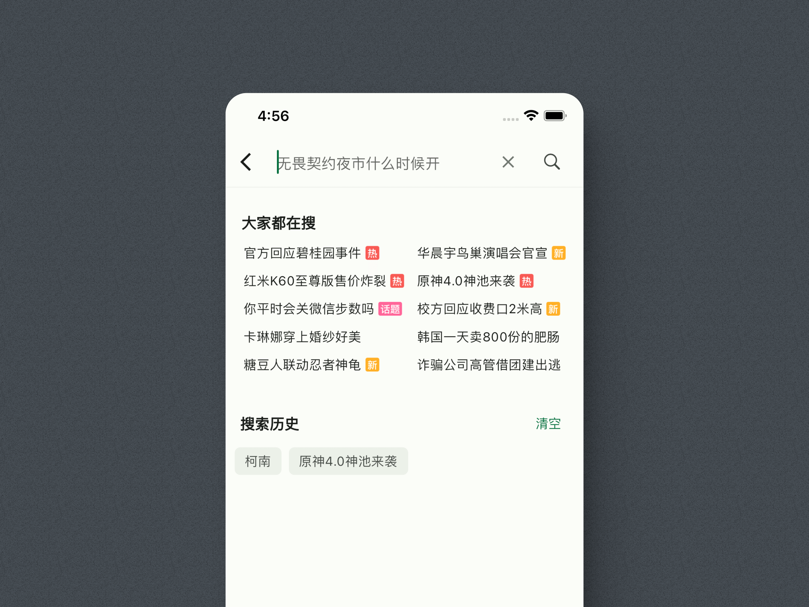
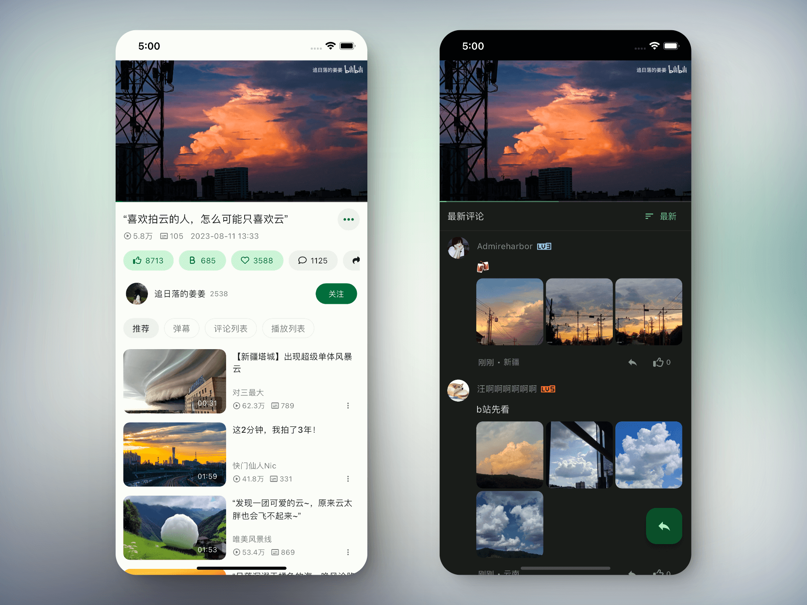
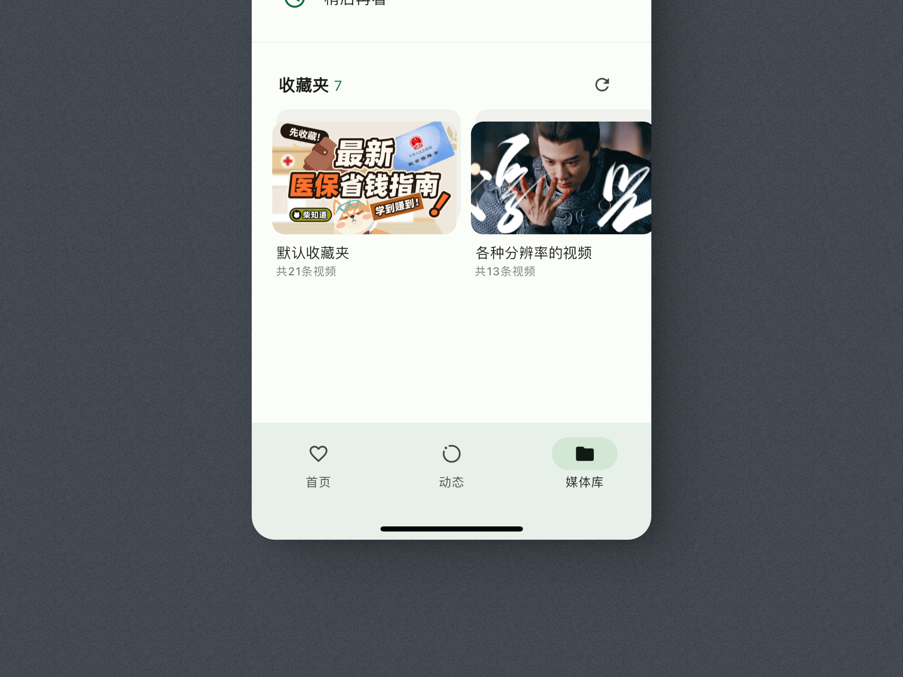
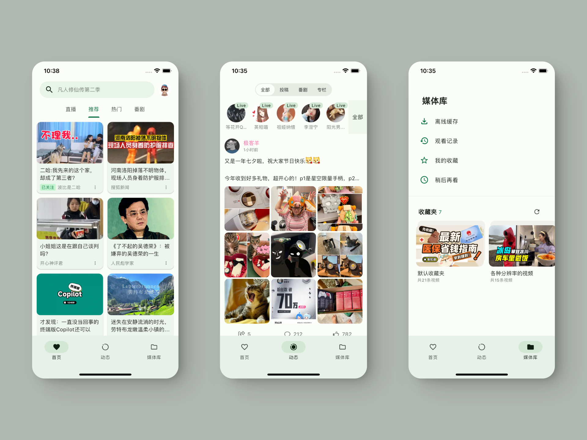

# GiliGili

基于Flutter的GiliGili视频播放客户端，支持Android、iOS、Windows、macOS、Linux和Web平台。

本项目是对PiliPlus的改进版本，增加了更多功能和优化。

<div align="center">
    
</div>

<div align="center">
    
 
 
 
</div>




<br/>

<br/>

## 开发环境

```bash
[✓] Flutter (Channel stable, 3.24.0, on Microsoft Windows [版本 10.0.19045.4046], locale zh-CN)
[✓] Android toolchain - develop for Android devices (Android SDK version 34.0.0)
[✓] Xcode - develop for iOS and macOS (Xcode 15.1)
[✓] Chrome - develop for the web
[✓] Android Studio (version 2022.3)
[✓] VS Code (version 1.85.1)
[✓] Connected device (3 available)
[✓] Network resources
```

## 功能特性

- 支持视频播放、弹幕显示
- 首页推荐、热门、动态、追番等功能
- 用户登录、个人中心、历史记录
- 支持收藏、点赞、投币等互动功能
- TV模式支持
- 多平台支持
- 视频超分辨率
- 合并弹幕
- 会员彩色弹幕
- Cookie登录
- 显示视频分段信息
- 调节字幕大小
- 直播弹幕
- SponsorBlock功能

## 优化改进

- 专栏界面优化
- 私信界面优化
- 收藏面板优化
- 画中画(PIP)支持
- 视频封面优化
- 回复界面优化
- 系统通知优化
- 评论显示优化
- 亮度调节优化
- 视频播放优化

## 声明

此项目（GiliGili）是个人为了兴趣而开发，仅用于学习和测试，请于下载后24小时内删除。
所用API皆从官方网站收集，不提供任何破解内容。
感谢PiliPlus的启发: [bggRGjQaUbCoE/PiliPlus](https://github.com/bggRGjQaUbCoE/PiliPlus)

## 致谢

- [bilibili-API-collect](https://github.com/SocialSisterYi/bilibili-API-collect)
- [flutter_meedu_videoplayer](https://github.com/zezo357/flutter_meedu_videoplayer)
- [media-kit](https://github.com/media-kit/media-kit)
- [dio](https://pub.dev/packages/dio)
- 等等

<br/>
<br/>
<br/>
